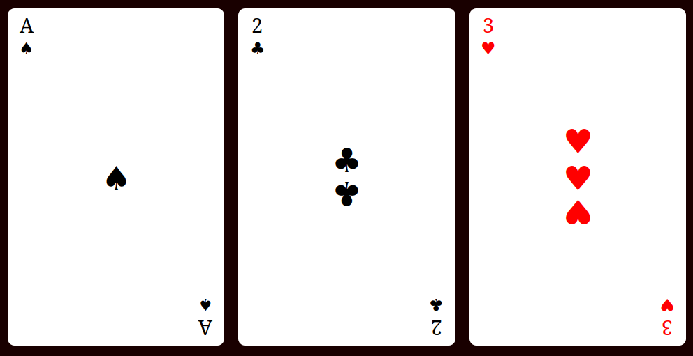

# ♣️ CSS Flexbox Playing Cards

A visually engaging project demonstrating how to layout playing cards using **HTML** and **CSS Flexbox**. Each card mimics the appearance of a real playing card using flex alignment, spacing, and CSS transforms.

---

## 📸 Preview



---

## 📁 Project Structure

```
css-flex-box-playing-cards/
├── index.html
├── styles.css
├── README.md
└── images/
    └── preview.png
```

---

## ✨ Features

- Fully responsive layout using Flexbox  
- Scaled and mirrored card symbols using `transform: scale()`  
- Red coloring for hearts (♥) and diamonds (♦)  
- Symmetrical alignment of values and suits on each card  
- Expandable layout with `flex-wrap` for responsiveness  

---

## 🧠 How It Works

Each card is a flex container with three sections:

1. **Left** – Top-left corner: card value and suit
2. **Middle** – Center: large scaled suit symbol(s)
3. **Right** – Bottom-right corner (flipped): mirrored suit and value

**Key CSS techniques used:**
- `display: flex`, `flex-direction: column`, `align-self`, `gap`
- `transform: scale()` and `scale(-1)` to flip text/symbols
- `justify-content` and `align-items` for positioning
- Utility class `.color-red` for styling hearts and diamonds red

---

## 🧪 How to Use

1. Clone or download this repo:
   ```bash
   git clone https://github.com/karianjahi/css-flex-box-playing-cards.git
   ```

2. Open `index.html` in your browser:
   ```bash
   open index.html
   ```

3. Modify or extend the layout in `index.html` and styles in `styles.css`.

---

## 💡 Customization Tips

- 🎴 Add new cards by copying and modifying an existing `.card` block
- 🔢 Change values (e.g., `4`, `J`, `Q`, `K`) and symbols (♠ ♣ ♥ ♦)
- 🎨 Modify CSS styles to create your own deck theme
- 📱 Tweak Flexbox sizing and scaling for better mobile responsiveness

---

## 🧱 Built With

- HTML5  
- CSS3 (Flexbox, Transforms, Custom Styling)

---

## 📜 License

This project is licensed under the MIT License — use it freely and learn from it!

---
